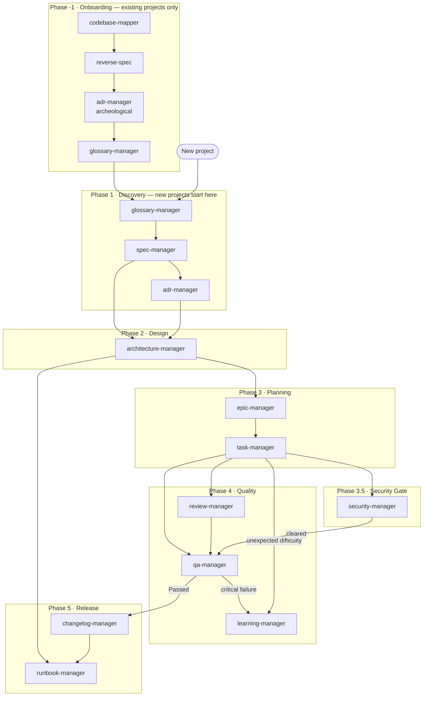

# Pipeline SDLC — Orquestrum

Complete map of the documentation-driven development flow (SDD). Each phase produces artifacts that feed the next phase. An orchestrator agent can use this file to infer execution order and dependencies between skills.

---

## Pipeline Overview



---

## Phases and Responsibilities

### Phase -1 — Onboarding (`docs/00-discovery/` + `docs/01-design/architecture/`)

> Triggered **only for existing projects** without SDD documentation. New projects start directly at Phase 1.

| Skill | Artifact | Trigger |
|-------|----------|---------|
| [codebase-mapper](../skills/codebase-mapper/SKILL.md) | `ARCHITECTURE-v0-as-is.md` | First step — always before any other onboarding skill |
| [reverse-spec](../skills/reverse-spec/SKILL.md) | `spec-v0-extracted.md` (Draft) | After codebase-mapper — extracts behaviors as requirements |
| [adr-manager](../skills/adr-manager/SKILL.md) | `ADR-XXX-{slug}.md` (Accepted) | For each implicit architectural decision found in the code |
| [glossary-manager](../skills/glossary-manager/SKILL.md) | `GLOSSARY.md` | To canonize domain terms found in the codebase |

**Rule:** No Phase 1 or later skill may be used without codebase-mapper having produced the as-is architecture. The extracted spec must start as `Draft` and requires human validation before becoming `Active`.

---

### Phase 1 — Discovery (`docs/00-discovery/`)

> New projects start here. Glossary is the implicit first step — it must exist before the first SPEC. Every agent must consult the glossary before creating any document to ensure consistent terminology.

| Skill | Artifact | Trigger |
|-------|----------|---------|
| [glossary-manager](../skills/glossary-manager/SKILL.md) | `GLOSSARY.md` | First step — project start or when new domain terms need to be canonized |
| [spec-manager](../skills/spec-manager/SKILL.md) | `spec-vX-{slug}.md` | After glossary — start of any new feature |
| [adr-manager](../skills/adr-manager/SKILL.md) | `ADR-XXX-{slug}.md` | Relevant technical decision or technology change |
| [pattern-manager](../skills/pattern-manager/SKILL.md) | `PATTERNS.md` | After first SPEC — catalog patterns and register adoptions |

**Rule:** No Epic may exist without an active SPEC. No Architecture may exist without at least one ADR to justify it. Every first adoption of a design pattern must have an associated ADR and an entry in `PATTERNS.md`.

---

### Phase 2 — Design (`docs/01-design/`)

| Skill | Artifact | Trigger |
|-------|----------|---------|
| [architecture-manager](../skills/architecture-manager/SKILL.md) | `ARCHITECTURE-vX-{slug}.md` | Active SPEC + accepted ADRs |

**Rule:** Architecture is the materialization of decisions (ADRs) applied to requirements (SPEC). Every component change requires simultaneous diagram update.

---

### Phase 3 — Planning (`docs/02-planning/`)

| Skill | Artifact | Trigger |
|-------|----------|---------|
| [epic-manager](../skills/epic-manager/SKILL.md) | `E{ID}-{slug}.md` | SPEC + Architecture defined |
| [task-manager](../skills/task-manager/SKILL.md) | `T{ID}-{slug}.md` + `logs/T{ID}-log.md` + `TASK-INDEX.md` | Epic created |

**Rule:** Epics make vertical slices of the SPEC. Tasks are executable units that produce traceable code artifacts. Tier-0 tasks append to `MICRO-LOG.md` instead of creating individual files.

---

### Phase 4 — Quality (`docs/03-quality/`)

| Skill | Artifact | Trigger | Depends on |
|-------|----------|---------|------------|
| [review-manager](../skills/review-manager/SKILL.md) | `REVIEW-{ref}-{slug}.md` | Task(s) with status `Completed` | task-manager |
| [qa-manager](../skills/qa-manager/SKILL.md) | `QA-{ref}-{slug}.md` | Task(s) `Completed` + Review `Approved` | task-manager, review-manager |
| [learning-manager](../skills/learning-manager/SKILL.md) | `L-XXX-{slug}.md` | QA `Failed` or unexpected technical difficulty | task-manager, qa-manager |

**Rule:** QA validates against the SPEC. Review validates against code and security. Learning closes the loop by turning failures into knowledge.

---

### Phase 5 — Release (`docs/04-release/`)

| Skill | Artifact | Trigger | Depends on |
|-------|----------|---------|------------|
| [changelog-manager](../skills/changelog-manager/SKILL.md) | `CHANGELOG.md` + `RELEASE-vX.Y.Z.md` | QA(s) with status `Passed` | qa-manager |
| [runbook-manager](../skills/runbook-manager/SKILL.md) | `RUNBOOK.md` | New release created or infrastructure change | architecture-manager, changelog-manager |

**Rule:** No release without QA Passed. No deploy without updated Runbook. The changelog connects software versions to delivered epics and tasks.

---

## Complete Artifact Structure

```
docs/
├── CHECKPOINT.md                   ← session state (written by Helm/orchestrators)
├── 00-discovery/
│   ├── glossary/      → GLOSSARY.md
│   ├── spec/          → spec-v1-{slug}.md, spec-v2-{slug}.md ...
│   └── adr/           → ADR-001-{slug}.md, ADR-002-{slug}.md ...
├── 01-design/
│   └── architecture/  → ARCHITECTURE-v0-as-is.md (codebase-mapper only)
│                         ARCHITECTURE-v1-{slug}.md ...
├── 02-planning/
│   ├── epics/         → E001-{slug}.md, E002-{slug}.md ...
│   └── tasks/
│       ├── TASK-INDEX.md           ← auto-maintained index of all tasks
│       ├── MICRO-LOG.md            ← Tier-0 task entries (no individual files)
│       ├── T001-{slug}.md, T002-{slug}.md ...
│       └── logs/      → T001-log.md ...  (Tier 1/2 only; short form, no slug)
├── 03-quality/
│   ├── review/        → REVIEW-{ref}-{slug}.md ...
│   ├── qa/            → QA-{ref}-{slug}.md ...
│   └── learning/      → L-001-{slug}.md ...
└── 04-release/
    ├── CHANGELOG.md
    ├── RELEASE-v1.0.0.md ...
    └── RUNBOOK.md
```

**Filename slug convention** (applies to all files above that include `{slug}`):
- Derived from the document title in kebab-case-lowercase
- Max 50 characters, truncated on the last complete word
- Immutable after creation — title changes do not rename the file
- Cross-references always use the short form (ID or version only)

---

## Artifact Flow & Context Fencing

### How Artifacts Flow Between Phases

Each phase boundary is a handoff point. The receiving orchestrator treats all upstream artifacts as **read-only constraints**.

```
Discovery (Lore) → Design (Forge):
  Input:  SPEC [Active] + ADRs [Accepted] + GLOSSARY
  Fence:  Forge cannot modify SPEC, ADRs, or GLOSSARY
  Output: ARCHITECTURE-vX-{slug} with diagram + component map

Design → Planning (Forge owns 2–3):
  Input:  ARCHITECTURE + SPEC [read-only] + ADRs [read-only] + PATTERNS
  Fence:  Cannot modify Architecture or SPEC during planning
  Output: Epics with spec_ref + Tasks with artifact paths + Logs + TASK-INDEX

Planning → Quality (Forge → Ward):
  Input:  Completed Tasks with non-empty Artifacts sections + Logs + TASK-INDEX
  Fence:  Ward cannot modify Tasks — creates correction Tasks if needed
  Output: REVIEW-{ref}-{slug} [Approved] + QA-{ref}-{slug} [Passed] + optional L-XXX-{slug}

Quality → Release (Ward → Cast):
  Input:  QA [Passed] + no Critical findings open + approved artifact versions
  Fence:  Cast cannot modify approved code or quality docs
  Output: RELEASE-vX.Y.Z + CHANGELOG.md + RUNBOOK.md
```

### Context Isolation by Phase

| Phase | Orchestrator | Isolation Level | May Read | Must NOT Write |
|-------|-------------|----------------|----------|----------------|
| 0–1 | Lore | High | Industry standards, past SPECs, ADRs | Code, tasks, epics, architecture, releases |
| 2–3 | Forge | Medium | All discovery artifacts (read-only), existing Architecture | SPECs, ADRs, Glossary |
| 4 | Ward | Medium | All previous phases (strictly read-only) | SPECs, Architecture, Task descriptions, any code |
| 5 | Cast | Low | All artifacts (read-only for code and quality docs) | Code, decisions, test results |

### Handoff Checklist Protocol

Every artifact produced by a skill includes a `## Handoff Checklist` section. Helm validates this checklist at each gate:

- **Gate blocked** if any critical `[ ]` item remains open
- **Gate advances** only when all mandatory checks are `[x]`
- **Promotion rule:** tier never demotes mid-flight — only promotes if a gate reveals unexpected scope

### Few-Shot Reference Injection

Reference files in `skills/*/references/` that contain `<!-- inject:start -->` / `<!-- inject:end -->` markers are automatically included in Cursor, Aider, and Windsurf builds by `scripts/convert.py`. This ensures few-shot examples reach agents that cannot read files at runtime.

---

## Bidirectional Traceability

Every artifact must be able to answer:
- **Upward:** Which SPEC/ADR originated this?
- **Downward:** Which Tasks/Reviews/QAs/Releases derived from this?

Always use the `References` section of templates to keep this chain intact.

---

## Orchestrator Team

| Agent | Phases | Skills governed | File |
|-------|--------|----------------|------|
| [Helm — The Architect](../agents/helm.md) | all | — (pure coordinator) | `agents/helm.md` |
| [Trace — Onboarding Lead](../agents/trace.md) | -1 | codebase-mapper, reverse-spec, adr-manager, glossary-manager | `agents/trace.md` |
| [Lore — Product Strategist](../agents/lore.md) | 1 | glossary-manager, spec-manager, adr-manager | `agents/lore.md` |
| [Forge — Dev Lead](../agents/forge.md) | 2–3 | pattern-manager, architecture-manager, epic-manager, task-manager | `agents/forge.md` |
| [Cipher — Security Lead](../agents/cipher.md) | 3.5 | security-manager | `agents/cipher.md` |
| [Ward — Quality Lead](../agents/ward.md) | 4 | review-manager, qa-manager, learning-manager, learning-aggregator | `agents/ward.md` |
| [Cast — Ship Lead](../agents/cast.md) | 5 | changelog-manager, runbook-manager, archive-manager | `agents/cast.md` |
| [Flux — Support Lead](../agents/flux.md) | maintenance | checkpoint-manager (read + triage) | `agents/flux.md` |

---

## Skills Index

| Phase | Skill | Role |
|-------|-------|------|
| cross-cutting | checkpoint-manager | Session continuity — CHECKPOINT.md (Flux reads; Cast and Cipher write) |
| -1 | codebase-mapper | As-is map of existing projects |
| -1 | reverse-spec | Requirements extraction from existing code |
| 1 | glossary-manager | Canonical domain vocabulary (implicit first step of Discovery) |
| 1 | spec-manager | Requirements and success criteria |
| 1 | adr-manager | Architectural decisions |
| 1 | pattern-manager | Design pattern catalog and traceability |
| 2 | architecture-manager | System view and diagrams |
| 3 | epic-manager | Vertical decomposition of SPEC |
| 3 | task-manager | Execution with traceability |
| 3.5 | security-manager | Threat modeling, OWASP validation, SEC report |
| 4 | review-manager | Code quality and security (with traceability score) |
| 4 | qa-manager | Functional validation against SPEC |
| 4 | learning-manager | Failure knowledge capture |
| 4 | learning-aggregator | Cross-cutting pattern synthesis (triggered at milestone close, ≥3 L-XXX) |
| 3–4 | e2e-manager | E2E scenario map + regression report — invoked pre-implementation (Flow G) or pre-release (Flow H) |
| 5 | changelog-manager | Versioned and documented release |
| 5 | runbook-manager | Operational procedures |
| 5 | archive-manager | Release consolidation — reduces repository clutter |

---

## Alternative Flows

Beyond the standard Tier 0/1/2 classification, the following named flows address common scenarios that do not fit the main pipeline cleanly. Helm selects the appropriate flow during classification.

### Flow A — Hot-Fix (production incident)

```
Flux → Cipher (impact analysis) → Forge (task-manager direct) → Ward → Cast
```

- Artifact level: Echo → Pulse if security surface is touched
- Skips Lore (no SPEC) and Trace
- ADR required if observable production behavior changes
- SLA: must complete in a single session

### Flow B — Spike / Research

```
Lore (spec-manager, status=Draft) → ADR (status=Proposed) → learning-manager
```

- Artifact level: Echo (no implementation TASK)
- Goal: document hypotheses and decisions from a technical investigation
- Does not advance to Forge until SPEC transitions to `status=Approved`
- May produce L-XXX learning even without implementation

### Flow C — Tech Debt Cleanup

```
Forge (task-manager, no epic-manager) → Ward (qa-manager, no review-manager) → Cast
```

- Artifact level: Echo or Pulse
- No EPIC (refactoring produces no new functionality)
- Existing no-elevation-by-file-count rule in TIERS.md applies
- ADR required if an architectural pattern is changed

### Flow D — Documentation-Only

```
Lore → (glossary-manager or spec-manager) → Cast (changelog only)
```

- Artifact level: Echo
- Skips Forge, Cipher, Ward implementation gates
- Trigger: doc PRs, glossary updates, SPEC corrections without code changes

### Flow E — Proactive Security Audit

```
Helm → Cipher → Ward (learning-manager) → Flux (improvement backlog)
```

- Triggered periodically (not by a feature request)
- Produces SEC + L-XXX without an implementation TASK
- Ward creates improvement issues for Flux to prioritize

### Flow G — TDD Strict (test-first enforcement)

```
Lore (spec-manager, SC-XX in BDD) → Forge (e2e-manager: scenario map) → Forge (task-manager: Red phase first) → Ward (review-manager: TDD cycle audit) → Ward (qa-manager)
```

- Artifact level: Pulse or Chronicle (depending on tier)
- Key difference: `e2e-manager` is invoked **before** implementation to produce an E2E scenario map aligned with SPEC Success Criteria
- Ward's review-manager checks TDD cycle evidence in Task log before approving
- A SC-XX without a matching failing test at Red phase blocks task completion
- Use when: the team mandates test-first on Tier 1 (not just Tier 2)

### Flow H — E2E Regression (pre-release or periodic)

```
Helm → Ward (e2e-manager: regression run) → Ward (qa-manager: E2E results) → Cast or Flux (backlog)
```

- Artifact level: Echo (no new feature; produces E2E-REPORT)
- Triggered by: pre-release gate OR periodic schedule (e.g. weekly against staging)
- Does NOT produce TASK or EPIC — purely validation
- Outcome: `Passed` → Cast proceeds to release; `Failed` → Flux creates correction tasks

### Flow F — Onboarding Fast-Path (partially documented project)

```
Trace (codebase-mapper + reverse-spec) → Lore (validate spec-v0 → promote to spec-v1) → Forge
```

- Allows partially documented projects to enter the pipeline without full re-documentation
- Trace produces Draft; Lore promotes to Approved with human review
- Continues from Phase 2 (Design) once SPEC is Approved

---

## Pipeline Governance Documents

| Document | Purpose |
|----------|---------|
| [TIERS.md](TIERS.md) | Work classification by activity type and size — defines required artifacts |
| [MODELS.md](MODELS.md) | LLM model assignment per agent and skill — token cost optimization |
