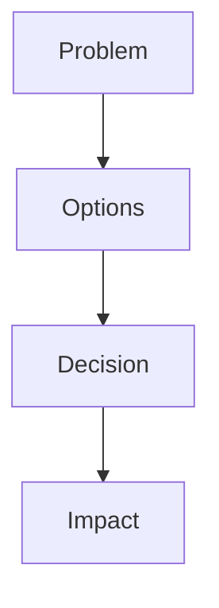

# ADR-XXX — {TITLE}

Status: 🟢 Accepted | 🟡 Proposed | 🔴 Deprecated  
Date: YYYY-MM-DD HH:mm

---

## Context

{decision context}

---

## Decision Flow

---

## Decision

{decision made}

---

## Consequences

### Positive

- {positive impact}

### Negative

- {negative impact}

---

## Impact

- Epics:
- Tasks:
- Architecture:

---

## References

- Spec: [spec-vX](../../00-discovery/spec/spec-vX.md)
- Architecture: [ARCHITECTURE-vX](../../01-design/architecture/ARCHITECTURE-vX.md)
- Learning:
