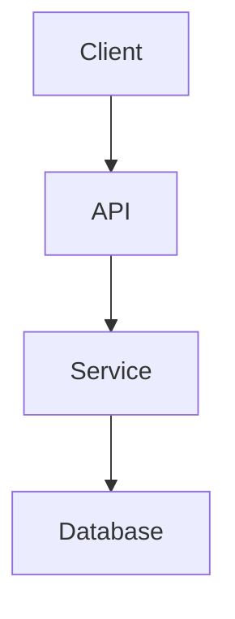

# ARCHITECTURE vX — {TITLE}

Status: 🟢 Active | 🟡 Draft  
Created: YYYY-MM-DD HH:mm  
Updated: YYYY-MM-DD HH:mm

---

## Derived From

- Spec: [spec-vX](../../00-discovery/spec/spec-vX.md)

---

## Overview

{architecture overview}

---

## System Diagram

---

## Components

| Component | Responsibility | Technology | Pattern(s) |
|-----------|---------------|-----------|------------|
| {component} | {what it does} | {tech} | {Repository / Strategy / etc or —} |

---

## Data Flow

{data flow description}

---

## Decisions

- [ADR-XXX](../../00-discovery/adr/ADR-XXX.md)

---

## Patterns

- Adopted patterns: [PATTERNS.md](../../00-discovery/patterns/PATTERNS.md)

---

## References

- Spec: [spec-vX](../../00-discovery/spec/spec-vX.md)
- ADR: `docs/00-discovery/adr/`
- Patterns: [PATTERNS.md](../../00-discovery/patterns/PATTERNS.md)

---

## Handoff Checklist

> Complete before signaling completion to Forge / epic-manager.

- [ ] All `{...}` placeholders replaced with real content
- [ ] At least one architecture diagram present (Mermaid or equivalent)
- [ ] All ADRs referenced in the decisions section exist with Accepted status
- [ ] Component map covers all modules mentioned in the active SPEC
- [ ] Technology stack decisions justified with ADR references
- [ ] Status set to `Active` (not Draft)
- [ ] Handoff to: **epic-manager** (Forge) — bring Component Map and spec_ref
