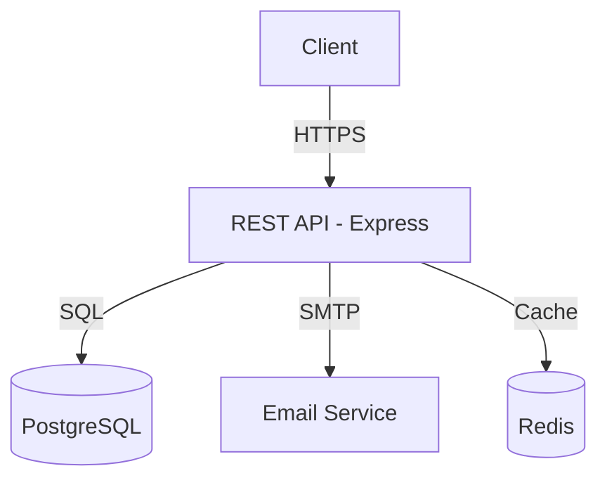

## Few-Shot Examples

<!-- inject:start -->
### ✅ Good Output — Architecture with decision traceability

```markdown
## Architecture Diagram



## Component Map

| Component | Responsibility | Technology | ADR Reference |
|-----------|---------------|------------|---------------|
| REST API | Handle HTTP requests, validation, routing | Express + TypeScript | ADR-001 |
| Database | Persist user and session data | PostgreSQL 15 | ADR-002 |
| Cache | Session storage, rate limit counters | Redis 7 | ADR-003 |
| Email | Transactional notifications | SMTP via Nodemailer | ADR-004 |

## Technology Decisions

All decisions are documented in ADRs. See `docs/00-discovery/adr/` for full context.
```

### ❌ Anti-Pattern — Architecture without ADR links

```markdown
## Architecture

We'll use a Node.js API with PostgreSQL. Maybe Redis for caching later.
The frontend will call the API directly.
```

**Why rejected:** No diagram. No component map. Technology decisions not traced to ADRs. "Maybe later" is not an architectural decision. epic-manager cannot derive Epics from this document — it would be blocked at Gate 2→3.
<!-- inject:end -->

---
