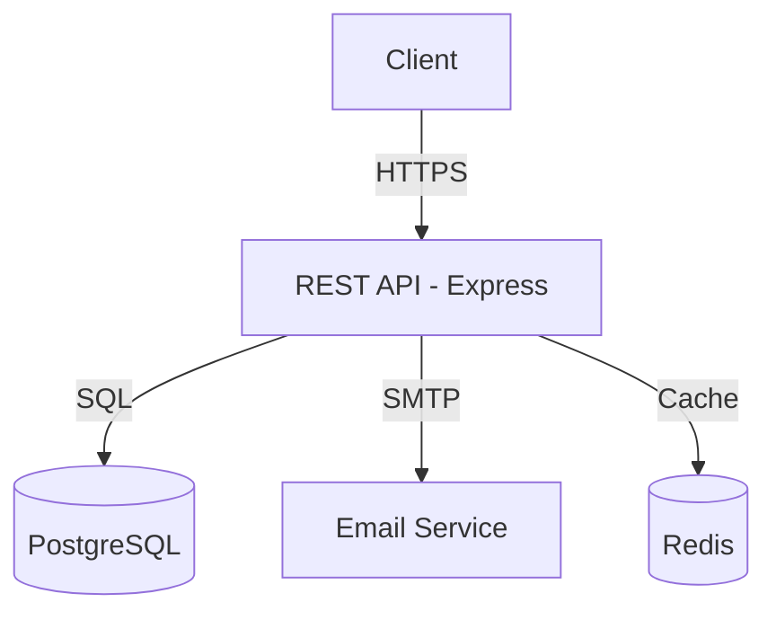

# Formal Reference: System Design and Documentation

## 1. Separation Principles

- **Components:** Must be modular. Each item listed in `Components` must have a clear responsibility (Single Responsibility Principle applied at the system level).
- **Coupling:** The `System Diagram` must make clear where critical dependencies and single points of failure exist.

## 2. Diagramming Patterns (Mermaid)

- **User Flows:** Use `sequenceDiagram` for complex interactions between client and server.
- **Structure:** Use `graph TD` or `graph LR` for network topology, services, and databases.
- **State:** Use `stateDiagram-v2` if the business logic involves complex state machines (e.g.: payment processing).

## 3. Maintainability

An architecture document is a living organism.

- Whenever a new component is added to the system, the `Components` field and the `System Diagram` MUST be updated simultaneously.
- The `Data Flow` section must highlight whether there is asynchronous processing (queues, webhooks) or synchronous processing (REST APIs).

## 4. Integration with ADRs

The architecture is the final result of multiple decisions. Each link in `Decisions` must point to the ADR that justifies the existence of that system design.

## 5. Patterns and Architecture

Adopted design patterns must be explicitly referenced in the `Components` section of the architecture document. The architecture must not only describe the components — it must indicate HOW they relate structurally.

**Instruction:** Before finalizing any architecture document:

1. Check if `docs/00-discovery/patterns/PATTERNS.md` exists
   - If yes: read the adopted patterns and reference them in the components where they apply
   - If no: signal to Forge that the pattern catalog has not yet been created

2. For each component in the diagram, if it implements a known pattern, document it:
   ```
   | UserRepository | User data abstraction | Repository Pattern |
   | PaymentAdapter | Stripe/PayPal integration | Adapter + Strategy |
   | OrderStateMachine | Order lifecycle | State Machine |
   ```

3. In the Mermaid diagram, use comments or labels to indicate patterns:
   ```mermaid
   graph TD
     Service[UserService] -->|Repository Pattern| Repo[IUserRepository]
     Repo -->|Adapter| DB[(PostgreSQL)]
   ```

**Complete pattern reference:** `./references/pattern-references.md`

---

## Few-Shot Examples

<!-- inject:start -->
### ✅ Good Output — Architecture with decision traceability

```markdown
## Architecture Diagram



## Component Map

| Component | Responsibility | Technology | ADR Reference |
|-----------|---------------|------------|---------------|
| REST API | Handle HTTP requests, validation, routing | Express + TypeScript | ADR-001 |
| Database | Persist user and session data | PostgreSQL 15 | ADR-002 |
| Cache | Session storage, rate limit counters | Redis 7 | ADR-003 |
| Email | Transactional notifications | SMTP via Nodemailer | ADR-004 |

## Technology Decisions

All decisions are documented in ADRs. See `docs/00-discovery/adr/` for full context.
```

### ❌ Anti-Pattern — Architecture without ADR links

```markdown
## Architecture

We'll use a Node.js API with PostgreSQL. Maybe Redis for caching later.
The frontend will call the API directly.
```

**Why rejected:** No diagram. No component map. Technology decisions not traced to ADRs. "Maybe later" is not an architectural decision. epic-manager cannot derive Epics from this document — it would be blocked at Gate 2→3.
<!-- inject:end -->

---

## Frontend & Mobile Architecture Patterns

### Native vs. Cross-Platform Decision Framework

Apply this decision tree when the architecture includes a mobile client:

```
Does the team have native iOS/Android expertise?
├── Yes → Does the product require deep platform integration (AR, background processing, health sensors)?
│         ├── Yes → Native (Swift/Kotlin) per platform
│         └── No  → React Native or Flutter (cross-platform)
└── No  → Does the product require complex animations or platform-specific UX?
          ├── Yes → Flutter (single codebase, high fidelity)
          └── No  → React Native (if web team exists) or Flutter
```

| Factor | Native | React Native | Flutter |
|--------|--------|-------------|---------|
| Team skill fit | iOS/Android engineers | Web/JS engineers | Any (Dart) |
| UI fidelity | Platform-native | Good (with libraries) | Excellent (custom renderer) |
| Deep platform APIs | Full access | Via bridges | Via platform channels |
| Code sharing with web | None | Partial (logic only) | None |
| Performance | Best | Good (bridged) | Very good (compiled) |
| Time to market | Slow (2 codebases) | Fast | Fast |

**ADR required when:** choosing between native and cross-platform, or switching platforms mid-project.

### Frontend Architecture Patterns

#### Micro-Frontends

**When to use:** multiple teams owning distinct UI areas of a large product (e.g., e-commerce: catalog team, checkout team, account team).

**Integration strategies:**

| Strategy | How it works | Best for |
|----------|-------------|---------|
| Module Federation (Webpack 5) | Each micro-frontend exposes components at runtime | Teams with independent deploy cadences |
| iFrame isolation | Full isolation, no shared state | Maximum independence, accept UX limitations |
| Web Components | Framework-agnostic custom elements | Mixed-framework teams |
| Route-based composition | Each team owns URL segments, composed at edge/CDN | Simple isolation with routing |

**Trade-offs:** increased operational complexity, shared dependency versioning challenges, requires contract testing between teams.

#### Islands Architecture (Partial Hydration)

**When to use:** content-heavy sites (marketing, docs, e-commerce listings) where most content is static but specific islands are interactive.

**Pattern:**
```
Static HTML shell (server-rendered, zero JS)
  ├── Island: SearchBar (hydrated immediately)
  ├── Island: AddToCartButton (hydrated on visible)
  └── Static: ProductDescription (never hydrated)
```

**Frameworks:** Astro (any UI framework), Qwik (resumability), Next.js App Router (React Server Components).

**ADR required when:** choosing between full SPA, SSR, and islands/partial hydration.

#### React Server Components (RSC) / App Router Boundary

**Client vs. Server component decision:**

| Component does... | Use |
|-------------------|-----|
| Fetch data directly from DB/API | Server Component |
| Render static/computed content | Server Component |
| Use `useState`, `useEffect`, event handlers | Client Component |
| Use browser APIs (localStorage, window) | Client Component |
| Wrap interactive Client Components | Server Component (pass as `children`) |

**Rule:** push the client boundary as far down the tree as possible. A page should be a Server Component wrapping a minimal Client Component island.

### State Management Architecture

Apply this decision framework before choosing a state management library:

```
Is the state shared across routes/screens?
├── No  → Local state (useState / useReducer) — no library needed
└── Yes → Is the state server-synced data (API responses)?
          ├── Yes → Server state library (TanStack Query, SWR, Apollo)
          └── No  → Is it simple global UI state (theme, modals, user)?
                    ├── Yes → Context API or Zustand (lightweight)
                    └── No  → Complex derived state or time-travel debug needed?
                              ├── Yes → Redux Toolkit
                              └── No  → Jotai or Zustand
```

**ADR required when:** introducing a global state management library for the first time.

### Performance Budget Architecture

Define performance constraints at the architecture level, not QA level:

| Constraint | Default target | Where defined |
|-----------|---------------|--------------|
| Initial bundle (JS gzipped) | < 200KB | Architecture doc, enforced in CI |
| Route chunk (lazy-loaded) | < 50KB | Architecture doc |
| LCP target | < 2.5s (3G throttled) | Architecture doc, measured in QA |
| Image format | WebP with AVIF fallback | ADR |
| Font loading strategy | `font-display: swap` + preload critical fonts | Architecture doc |

**Enforcement:** add `bundlesize` or `bundlewatch` to CI pipeline. Document thresholds in the Architecture artifact, not just in config files.

<!-- inject:start -->
### ✅ Good Architecture Decision — State Management

```markdown
## State Management

After evaluating options (see ADR-005), the decision is:

- **Server state:** TanStack Query — handles caching, background refetching, optimistic updates for all API data
- **Global UI state:** Zustand — auth context (user, token), modal states, notification queue
- **Local component state:** React useState / useReducer — form state, UI toggles not shared across routes

**Rationale:** introducing Redux for a product with < 10 shared global state slices would be over-engineering. Zustand provides the same patterns without the boilerplate. TanStack Query eliminates the need to store API responses in global state.

**ADR reference:** ADR-005 — State Management Architecture
```

### ❌ Anti-Pattern — Architecture without performance budget

```markdown
## Architecture

We'll use Next.js with React Query for data fetching. The design system will be built with shadcn/ui. For state, we'll use Redux because it's familiar to the team.
```

**Why rejected:** No performance budget defined. No justification for Redux when server state is handled by React Query. No client/server component boundary strategy. epic-manager cannot derive tasks from this — there's no "what gets built, in what order, with what constraints."
<!-- inject:end -->
