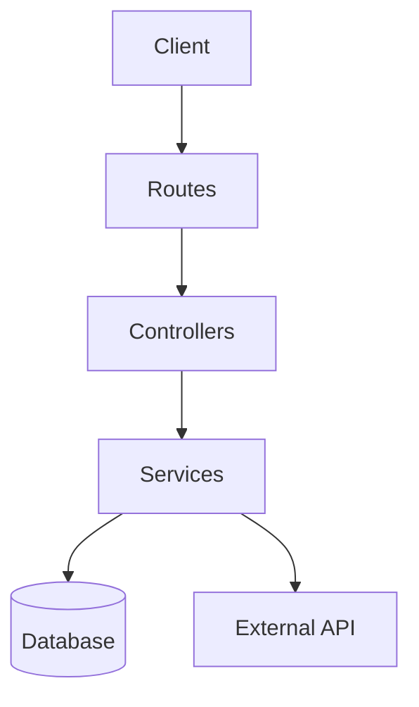

# References — codebase-mapper

Read this file before performing any mapping. It defines the principles, techniques, and checklist that guide the codebase-mapper.

---

## 1. Core Principle: Archaeology, not Judgment

The codebase-mapper follows the principle of **archaeological documentation**: record what exists faithfully, without projecting what should exist. The correct analogy is an archaeologist cataloging a site — not an architect redesigning it.

**Practical implication:** if you find code that seems wrong, document it with `⚠️ Observation` and describe what was found. Do not judge, do not propose corrections.

---

## 2. Reading Hierarchy

Read files in this priority order to build the map:

### Layer 1 — Infrastructure (start here)
- `Dockerfile`, `docker-compose.yml`, `kubernetes/`, `terraform/`
- `.env.example`, `.env.sample`, `config/`, `settings/`
- CI/CD: `.github/workflows/`, `.gitlab-ci.yml`, `Jenkinsfile`

### Layer 2 — Data
- Schema manifests: `prisma/schema.prisma`, `db/schema.rb`, `alembic/versions/`, `migrations/`
- ORM models: `models/`, `entities/`, `domain/`
- Database seeds and fixtures

### Layer 3 — Domain
- Services, use cases, domain logic: `services/`, `usecases/`, `domain/`
- Background jobs: `jobs/`, `workers/`, `tasks/`
- Event handlers: `listeners/`, `subscribers/`

### Layer 4 — Interface
- Routes: `routes/`, `controllers/`, `handlers/`, `resolvers/`
- Authentication/authorization middlewares
- Validators and serializers

**Never skip layers** — understanding data before routes avoids misinterpreting routes.

---

## 3. Stack Identification by Manifest

| File found | Inferred stack |
|-------------------|---------------|
| `package.json` | Node.js / JavaScript / TypeScript |
| `Gemfile` | Ruby |
| `requirements.txt` / `pyproject.toml` | Python |
| `go.mod` | Go |
| `pom.xml` / `build.gradle` | Java / Kotlin |
| `composer.json` | PHP |
| `Cargo.toml` | Rust |
| `*.csproj` / `*.sln` | .NET / C# |

**For frameworks**, read the main dependencies from the manifest — do not assume from the entry file.

---

## 4. Entry Point Identification

### HTTP (look for):
- Express/Fastify/Koa: `app.get(`, `router.post(`, `app.use(`
- Rails: `routes.rb`
- Django/FastAPI: `urlpatterns`, `@app.get(`, `@router.post(`
- Spring: `@GetMapping`, `@PostMapping`, `@RestController`

### Background Jobs (look for):
- Bull/BullMQ: `Queue(`, `Worker(`, `@Processor(`
- Sidekiq: `class *Job < ApplicationJob`, `perform_later`
- Celery: `@app.task`, `@shared_task`
- n8n: JSON workflows in `/.n8n/` or `workflows/`

### CLI (look for):
- Commander.js: `program.command(`
- Thor (Ruby): `class * < Thor`
- Click (Python): `@click.command(`
- Cobra (Go): `cobra.Command{`

---

## 5. External Integration Identification

Code signals indicating external integration:

| Signal | Indicates |
|-------|--------|
| `process.env.{NAME}_API_KEY` | Third-party API |
| `import { ... } from 'stripe'` | Payment SDK |
| `axios.get('https://api.{service}')` | External HTTP client |
| `new AWS.S3(` | AWS S3 |
| `nodemailer.createTransport(` | Email service |
| `admin.initializeApp(` | Firebase |
| `new OpenAI(` | OpenAI API |
| `twilio.messages.create(` | Twilio SMS |

---

## 6. Mermaid — Choosing the Right Diagram

Use `graph TD` when:
- You want to show **static structure** (components, layers, dependencies)
- The system has a clear layered architecture (API → Service → Repo → DB)

Use `sequenceDiagram` when:
- You want to show **critical flows** (authentication, checkout, webhook)
- The call sequence between components is the most important information

**In large projects:** create a `graph TD` for the general topology + up to 2 `sequenceDiagram` for the most critical flows.

Example of a minimal `graph TD`:


---

## 7. Observation Flags

Use `⚠️ Observation` (without judgment) to record:

- Mixed architectural pattern (e.g.: some controllers use services, others access the DB directly)
- Very old dependency version or with known vulnerabilities (record, do not fix)
- `TODO` / `FIXME` / `HACK` comments in code — evidence of known debt
- Obvious dead code (functions never called, unused routes)
- Multiple patterns for the same thing (e.g.: authentication done in 3 different ways)
- Hardcoded configurations that should be in environment variables
- Migrations without a defined rollback

**Format:**
```
⚠️ Observation: {component/file} — {what was found, without judgment}
```

---

## 8. Pre-Delivery Checklist

Before saving `ARCHITECTURE-v0-as-is.md`, verify:

- [ ] Technology stack identified with versions (when available in the manifest)
- [ ] All entry points listed (HTTP + workers + CLI — even if empty with "not identified")
- [ ] Data model with main entities and relationships
- [ ] External integrations mapped from environment variables and imports
- [ ] Mermaid diagram generated and mentally reviewed (does it make topological sense?)
- [ ] Observations section filled in (or explicitly "none")
- [ ] No improvement proposals in the document — description only
- [ ] No code files were modified during the mapping

---

## 9. Scope in Large Codebases

If the project has more than ~50 code files, **do not attempt to map everything at once**. Propose to the user to map by module:

```
Proposed modular mapping:
1. auth module (login, session, permissions)
2. users module (CRUD, profile)
3. payments module (checkout, billing)
4. notifications module (email, push)
```

Produce one `ARCHITECTURE-v0-as-is.md` per module if necessary, or a consolidated document with sections per module.

---

## 10. Comparison with Existing Docs

If `docs/` already exists in the project:

1. Read the previously documented architecture
2. For each documented component: does it still exist in the code?
3. For each component found in the code: is it documented?
4. Record discrepancies as:

```
⚠️ Doc/code divergence: {component} — documented as {X} but code shows {Y}
```

Do not decide which is correct — flag it for the user to validate.
