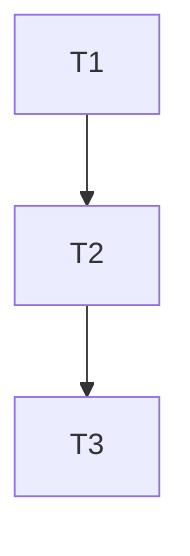

# EPIC E{ID} — {TITLE}

Status: 🟢 In Progress | ⚪ Not Started | 🔵 Completed  
Created: YYYY-MM-DD HH:mm

---

## Description

{which part of the SPEC this covers}

---

## Scope

- Part of Spec: [spec-vX](../../00-discovery/spec/spec-vX.md)
- Domain:

---

## Execution Flow

---

## Tasks

- [T1](../tasks/T1.md)
- [T2](../tasks/T2.md)

---

## Notes

{additional context}

---

## References

- Spec: [spec-vX](../../00-discovery/spec/spec-vX.md)
- Tasks:
