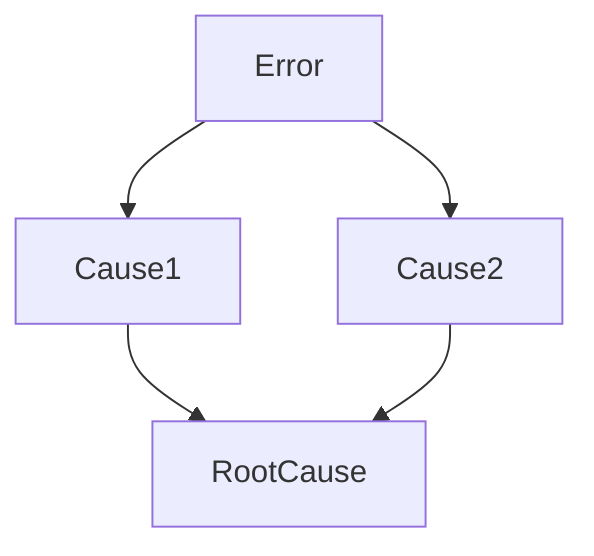

# LEARNING-XXX — {TITLE}

Status: 🟢 Active | 🔵 Archived  
Date: YYYY-MM-DD HH:mm

---

## Context

{observed situation}

---

## Decision Reference

- [ADR-XXX](../../00-discovery/adr/ADR-XXX.md)
- Spec: [spec-vX](../../00-discovery/spec/spec-vX.md)

---

## Outcome

{result}

---

## Issues Identified

1. {problem}
2. {cause}

---

## Root Cause Map

---

## Patterns

### 🔴 Failure Patterns

- {failure pattern}

### 🟢 Success Patterns

- {success pattern}

---

## Root Cause

{root cause}

---

## Recommendation

### Primary

1. {primary action}

### Secondary

2. {fallback}

### Alternative Paths

- {alternatives}

---

## Actionable Tasks

- Task:
  - Agents:
  - Steps:

---

## Related Tasks

- [T1](../../02-planning/tasks/T1.md)

---

## Impact

- Scope: local | system | architecture
- Risk: 🔴 High | 🟡 Medium | 🟢 Low
- Frequency: unique | recurring

---

## Confidence

🟢 High | 🟡 Medium | 🔴 Low

---

## References

- ADR: [ADR-XXX](../../00-discovery/adr/ADR-XXX.md)
- Tasks:
- Logs:
