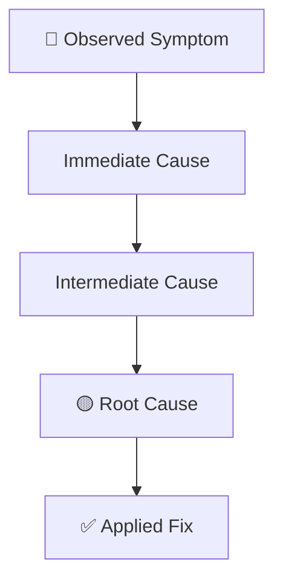

# Learning References

## Learning Type Taxonomy

| Type | Description | When to use |
|------|----------|------------|
| **Incident** | Unexpected failure in production or QA that caused impact | QA critically failed, unexpected production behavior |
| **Experiment** | Intentional test of new technology, pattern, or approach | New integration, POC, stack change |
| **Pattern** | Recurring behavior identified across multiple incidents | Same error occurred 2+ times, systemic failure pattern |

## Impact Scope

| Scope | Definition |
|--------|----------|
| `local` | Affects a single isolated module, function, or component |
| `system` | Affects multiple modules or a complete system flow |
| `architecture` | Questions design decisions or architectural structure (generates ADR) |

## Confidence Levels

| Level | Criterion |
|-------|---------|
| 🟢 **High** | Root cause confirmed with evidence (logs, reproduction, test) |
| 🟡 **Medium** | Plausible hypothesis with partial evidence |
| 🔴 **Low** | Speculation based on symptoms, without confirmed reproduction |

## Root Cause Analysis Framework

### 5 Whys Method
Ask "why?" 5 times starting from the symptom until reaching the root cause:

```
Symptom → Why? → Cause 1 → Why? → Cause 2 → ... → Root Cause
```

### Root Cause Categories

1. **Infra**: Server configuration issue, network, container, resources (CPU/RAM)
2. **Code**: Logic bug, race condition, type error, null pointer
3. **Data**: Incorrect schema, failed migration, corrupted or unexpected data
4. **Integration**: External API behaving differently than documented, timeout
5. **Process**: Lack of validation before merge, absence of test for the case

## Mermaid Diagram Template (Root Cause)



## Archiving Criteria

A Learning moves from `Active` to `Archived` when:
- The fix has been applied and validated in QA
- The pattern has been documented as a guardrail in an ADR or Spec
- The incident has not recurred after 3+ development cycles
