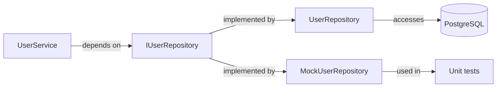

# PA-{NNN} — {Pattern Name}: {Application Context}

> Example title: `PA-003 — Repository: User Data Access`

---

## Adoption Context

**Problem that motivated it:**
{Describe the specific problem that led to adopting this pattern in this context — not the pattern definition, but what was wrong or incomplete without it.}

**Alternatives considered:**
| Alternative | Discarded because |
|-------------|------------------|
| {Direct DB access in service} | Strong coupling — difficulty of testing and database replacement |
| {Active Record} | {reason} |

**Associated ADR:** [ADR-XXX](../../adr/ADR-XXX.md)
> If no ADR exists: create one via `adr-manager` before finalizing this record.

---

## Where Applied

| Component / File | Role in Pattern | Note |
|-----------------|----------------|------|
| `{src/repositories/UserRepository.ts}` | Concrete implementation | Accesses PostgreSQL via Prisma |
| `{src/services/UserService.ts}` | Consumer (depends on abstraction) | Injects IUserRepository |
| `{src/interfaces/IUserRepository.ts}` | Contract / Port | Interface defining the contract |

---

## Interface / Contract

> Language-agnostic pseudocode — shows the abstraction, not the implementation.

```
// Contract (Port / Interface)
interface {IUserRepository}:
  find(id: ID): User | null
  findAll(filters: Filters): User[]
  save(user: User): User
  delete(id: ID): void

// Concrete implementation
class {UserRepository} implements IUserRepository:
  // persistence detail here — Prisma, TypeORM, raw SQL, etc.

// Consumer — only knows the interface
class {UserService}:
  constructor(repo: IUserRepository)  // dependency injection
  getUser(id): User
    return this.repo.find(id)
```

---

## Diagram (optional)

> Use if the pattern involves multiple components with non-trivial flow.



---

## Trade-offs

**Gains:**
- {Testability — services can be tested with a repository mock}
- {Database replacement without changing business logic}

**Costs:**
- {More files — interface + implementation + injection}
- {Overhead for simple projects with few models}

**When this trade-off is worth it:** {e.g.: whenever there is non-trivial business logic over the data}

---

## Identified Inconsistencies

> List project components that SHOULD follow this pattern but do not.

- ⚠️ `{src/services/ProductService.ts}` — accesses DB directly without Repository. Should be refactored.

> If none: `[No inconsistencies identified]`

---

## References

| Type | File |
|------|------|
| Canonical pattern definition | `./references/pattern-references.md#repository` |
| Decision ADR | `docs/00-discovery/adr/ADR-XXX.md` |
| Architecture | `docs/01-design/architecture/ARCHITECTURE-vX.md` |
