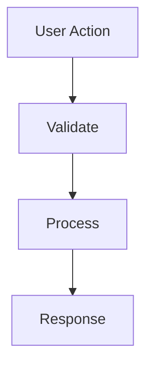

# SPEC vX — {TITLE}

Status: 🟢 Active | 🟡 Draft | 🔴 Deprecated  
Created: YYYY-MM-DD HH:mm  
Updated: YYYY-MM-DD HH:mm

---

## Context

- Domain:
- Objective:
- Scope:

---

## Overview

{general system description}

---

## Assumptions

> Assumptions are statements that must be true for this SPEC to make sense. If an assumption is false, all or part of the SPEC must be revisited. Document them before writing requirements.

| # | Assumption | Risk if false | Validated? |
|---|-----------|--------------|-----------|
| A1 | {statement we assume as true} | {what happens if it is wrong} | ✅ Yes / ❓ Not validated |
| A2 | | | |

---

## Requirements

> Use MoSCoW priority: **M** = Must (required for launch) | **S** = Should (important but workable) | **C** = Could (desirable if time allows) | **W** = Won't (out of scope for this version)

### Functional

| ID | Priority | Requirement |
|----|----------|------------|
| RF-01 | M | The system MUST {action} when {trigger} |
| RF-02 | S | The system MUST {action} when {trigger} |

### Non-Functional

| ID | Priority | Requirement |
|----|----------|------------|
| RNF-01 | M | The system must {metric + threshold} |

---

## Constraints

- {constraint 1}
- {constraint 2}

---

## Flows

### Main Flow

---

## Success Criteria

> Write in BDD format: **Given** {context} **When** {action} **Then** {expected result + metric}

| ID | Criterion (Given / When / Then) | Requirement covered |
|----|--------------------------------|---------------------|
| SC-01 | Given {initial state} When {user or system action} Then {observable result + threshold if applicable} | RF-01 |
| SC-02 | | |

---

## References

- Architecture: [architecture-vX](../../01-design/architecture/ARCHITECTURE-vX.md)
- ADR:
- Epics:
