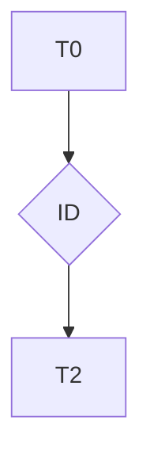

# T{ID} — {TITLE}

Status: 🟡 Pending | 🟢 In Progress | 🔵 Completed | 🔴 Blocked  
Created: YYYY-MM-DD HH:mm  
Updated: YYYY-MM-DD HH:mm

---

## Context Snapshot

- Spec: [spec-vX](../../00-discovery/spec/spec-vX.md)
- Epic: [E{ID}](../epics/E{ID}.md)
- Priority: 🔴 High | 🟡 Medium | 🟢 Low

---

## Description

{clear task description}

---

## Dependency Graph

---

## Dependencies

- [T?](./T?.md)

---

## Assigned Agents

- {agent}

---

## Tests

> All test files produced or modified by this task. Tests are first-class artifacts — omitting them blocks handoff in Tier 1 and 2.

| File | Type | SC covered |
|------|------|------------|
| `src/path/to/unit.spec.ts` | unit | SC-01, SC-02 |
| `e2e/path/to/flow.spec.ts` | e2e | SC-01 (happy path) |

### TDD Cycle

> Tier 1: recommended · Tier 2: mandatory · Tier 0: N/A

| # | Phase | Description |
|---|-------|-------------|
| 1 | 🔴 Red | {test written — fails as expected} |
| 2 | 🟢 Green | {minimum code to make test pass} |
| 3 | 🔵 Refactor | {code improved — all tests still pass} |

---

## Artifacts

- {generated code files — test files go in Tests section above}

---

## Related Learning

- [L-XXX](../../03-quality/learning/L-XXX.md)

---

## Notes

{technical decisions}

---

## Log

- [T{ID}-log](./logs/T{ID}-log.md)

---

## References

- Spec: [spec-vX](../../00-discovery/spec/spec-vX.md)
- Epic: [E{ID}](../epics/E{ID}.md)
- ADR:
- Learning:
- Log: [T{ID}-log](./logs/T{ID}-log.md)

---

## Handoff Checklist

> Complete before setting task status to Completed.

- [ ] All `{...}` placeholders replaced with real content
- [ ] `Tests` section lists every test file created or modified — each row has `Type` and `SC covered`
- [ ] `Artifacts` section lists all non-test files created or modified (no placeholders)
- [ ] All artifact paths verified to exist on disk
- [ ] `epic_ref` and `spec_ref` fields populated with valid IDs
- [ ] TDD Cycle table completed (Tier 2: mandatory; Tier 1: recommended)
- [ ] Acceptance criteria all marked as met
- [ ] Handoff to: **review-manager** (Ward) — bring Tests + Artifacts list and spec_ref
