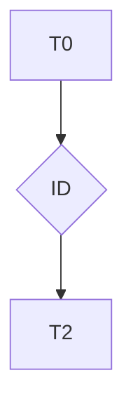

# T{ID} — {TITLE}

Status: 🟡 Pending | 🟢 In Progress | 🔵 Completed | 🔴 Blocked  
Created: YYYY-MM-DD HH:mm  
Updated: YYYY-MM-DD HH:mm

---

## Context Snapshot

- Spec: [spec-vX](../../00-discovery/spec/spec-vX.md)
- Epic: [E{ID}](../epics/E{ID}.md)
- Priority: 🔴 High | 🟡 Medium | 🟢 Low

---

## Description

{clear task description}

---

## Dependency Graph

---

## Dependencies

- [T?](./T?.md)

---

## Assigned Agents

- {agent}

---

## Artifacts

- {generated files}

---

## Related Learning

- [L-XXX](../../03-quality/learning/L-XXX.md)

---

## Notes

{technical decisions}

---

## Log

- [T{ID}-log](./logs/T{ID}-log.md)

---

## References

- Spec: [spec-vX](../../00-discovery/spec/spec-vX.md)
- Epic: [E{ID}](../epics/E{ID}.md)
- ADR:
- Learning:
- Log: [T{ID}-log](./logs/T{ID}-log.md)

---

## Handoff Checklist

> Complete before setting task status to Completed.

- [ ] All `{...}` placeholders replaced with real content
- [ ] `Artifacts` section lists every file created or modified (no placeholders)
- [ ] All artifact paths verified to exist on disk
- [ ] `epic_ref` and `spec_ref` fields populated with valid IDs
- [ ] Acceptance criteria all marked as met
- [ ] Handoff to: **review-manager** (Ward) — bring the Artifacts list and spec_ref
